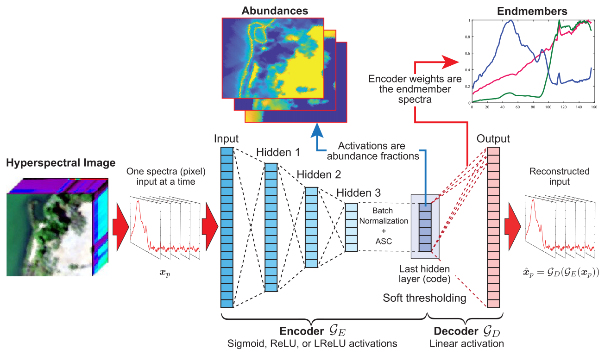
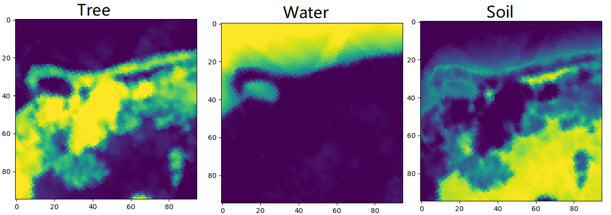
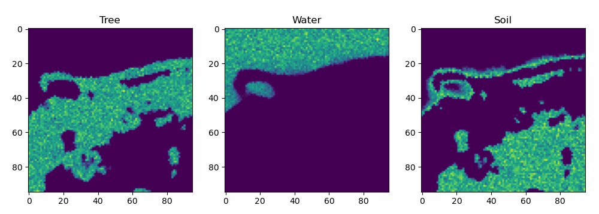
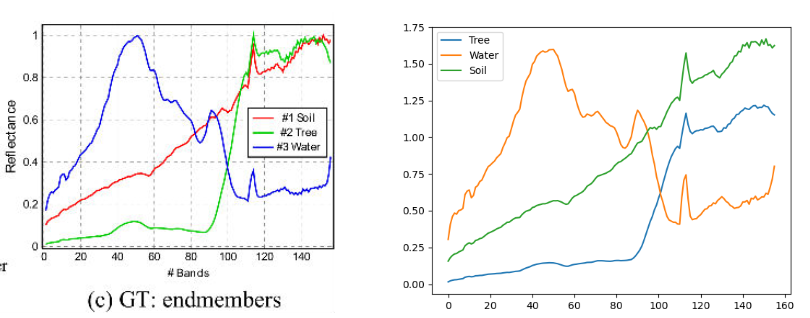

# Hyperspectral unmixing

非对称卷积自编码解混网络

利用卷积和全连接层估计出输入高光谱图像的端元和丰度，模型结构如图所示，分为Encoder部分和Decoder部分。Encoder部分的输出作为丰度信息。Decoder部分将丰度图再重新映射回HIS图像，这部分的权重即为端元信息。从而了完成光谱数据的分解。



## Top News

2022.05.12 仓库创建。完成了论文中模型在Samson数据集上的训练与提取。
- [ ] 基于3D卷积的自编码高光谱解码网络
- [ ] 基于空谱联合自注意力的卷积自编码网络的高光谱图像解混方法

## 所需环境

pytorch==1.8.0及以上

python==3.7及以上

## 性能情况

**丰度提取**

标签



提取结果



**端元提取**



左图为标签，右图为提取结果

## 训练步骤

1. 运行 $./tools/train.py$进行训练，训练结束后模型会自动保存在$./tools/logs$文件夹；
2. 模型与训练参数的设置文件在$./utils/opts.pt$文件中，按照以下代码进行设置。

```python
def model_opts(parser):
    """
    These options are passed to the construction of the model.
    Be careful with these as they will be used during unmixing.
    """
    group = parser.add_argument_group('Model AE')
    group.add('--encoder_type', '-encoder_type', type=str, default='deep',
    choices=['deep', 'shallow'],
    help="选择模型的两种结构，深层（deep）和前层（shallow）"
         "Options are: [deep|shallow]")
         
    # SLReLU unavailable, add assert in main    
    group.add('--soft_threshold', '-soft_threshold', type=str, default='SReLU',
    choices=['SReLU', 'SLReLU'],
    help="Options are: [SReLU|SLReLU]")
         
    group.add('--activation', '-activation', type=str, default='Leaky-ReLU',
    choices=['ReLU', 'Leaky-ReLU', 'Sigmoid'],
    help="激活函数"
         "[ReLU|Leaky-ReLU|Sigmoid]")

def train_opts(parser):
    """
    These options are passed to the training of the model.
    Be careful with these as they will be used during unmixing.
    """
    group = parser.add_argument_group('General')
    group.add('--src_dir', '-src_dir', type=str, default='../data/datasets/Samson/',
    help="数据集路径")
    
    group.add('--save_checkpt', '-save_checkpt', type=int, default=0,
    help="每隔多少个eopch保存一次模型，0表示只保存最后一个模型")
          
    group.add('--save_dir', '-save_dir', type=str, default="../tools/logs",
    help="模型保存路径")

    group.add('--num_bands', '-num_bands', type=int, default=156,
    help="输入高光谱图像的波段数")
    
    group.add('--end_members', '-end_members', type=int, default=3,
    help="需要提取的高光谱图像的端元数")
    
    group = parser.add_argument_group('Hyperparameters')
    group.add('--batch_size', '-batch_size', type=int, default=20,
    help="batch_size")
    
    group.add('--learning_rate','-learning_rate', type=float, default=1e-3,
    help="学习率")
    
    group.add('--epochs','-epochs', type=int, default=250,
    help="epochs")
    
    group.add('--gaussian_dropout', '-gaussian_dropout', type=float, default=0.2,
    help="用于正则化的乘性高斯噪声的均值")
    
    group.add('--threshold', '-threshold', type=float, default=1.0,
    help="soft-thresholding的大小")
    
    group.add('--objective', '-objective', type=str, default='SAD',
    choices=['MSE', 'SAD', 'SID'],
    help="目标函数" "Options are: [MSE|SAD|SID]")
```

## 提取步骤

1. 运行$./tools/extract.py$进行端元和丰度的提取，提取后的结果保存在$imgs$文件夹。
2. 参数设置文件在$./utils/extract_opts.pt$文件中，按照以下代码进行设置。

```python
def model_opts(parser):
    """
    模型的超参数设置
    """
    group = parser.add_argument_group('Model AE')
    group.add('--encoder_type', '-encoder_type', type=str, default='deep',
    choices=['deep', 'shallow'],
    help="选择模型的两种结构，深层（deep）和前层（shallow）"
         "Options are: [deep|shallow]")
         
    # SLReLU unavailable, add assert in main    
    group.add('--soft_threshold', '-soft_threshold', type=str, default='SReLU',
    choices=['SReLU', 'SLReLU'],
    help="Options are: [SReLU|SLReLU]")
         
    group.add('--activation', '-activation', type=str, default='Leaky-ReLU',
    choices=['ReLU', 'Leaky-ReLU', 'Sigmoid'],
    help="激活函数"
         "[ReLU|Leaky-ReLU|Sigmoid]")
         
def extract_opts(parser):
    """
    训练参数设置
    """
    group = parser.add_argument_group('General')
    group.add('--src_dir', '-src_dir', type=str, default='../data/datasets/Samson/',
    help="数据集路径")
    
    group.add('--ckpt', '-ckpt', type=str, default="../tools/logs/hyperspecae_final.pt",
    help="模型保存路径")
          
    group.add('--save_dir', '-save_dir', type=str, default="../imgs/",
    help="模型提取的丰度和端元保存路径")
    
    group.add('--num_bands', '-num_bands', type=int, default=156,
    help="输入高光谱图像的波段数")
    
    group.add('--end_members', '-end_members', type=int, default=3,
    help="需要提取的高光谱图像的端元数")
    
    group = parser.add_argument_group('Hyperparameters')
    group.add('--batch_size', '-batch_size', type=int, default=20,
    help="batch_size")
    
    group.add('--learning_rate','-learning_rate', type=float, default=1e-3,
    help="学习率")
    
    group.add('--epochs','-epochs', type=int, default=100,
    help="epochs")
    
    group.add('--gaussian_dropout', '-gaussian_dropout', type=float, default=0.2,
    help="用于正则化的乘性高斯噪声的均值")
    
    group.add('--threshold', '-threshold', type=float, default=1.0,
    help="soft-thresholding的大小")
```
